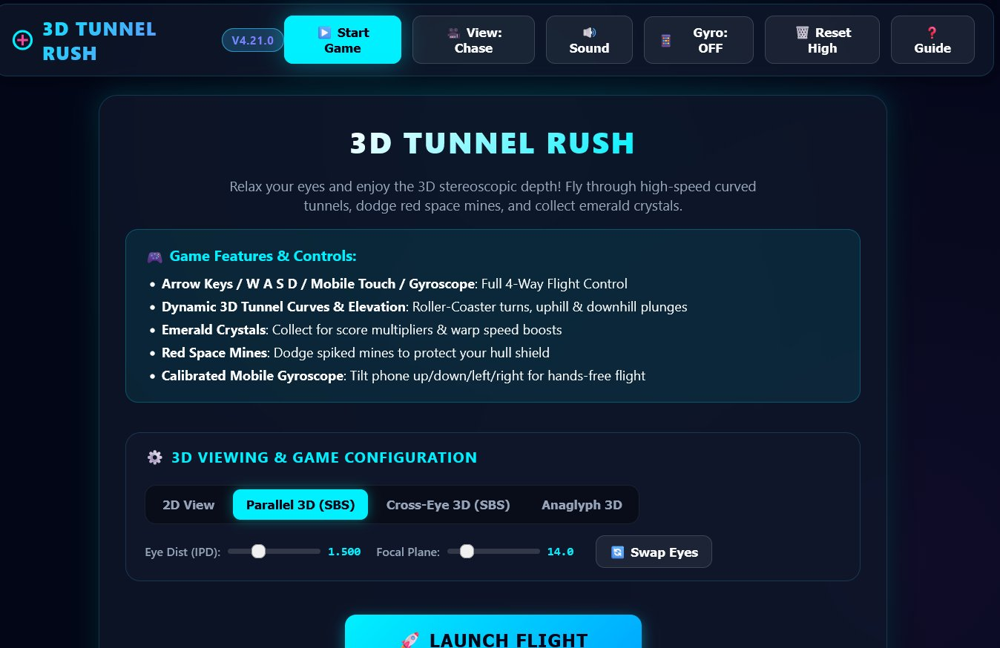
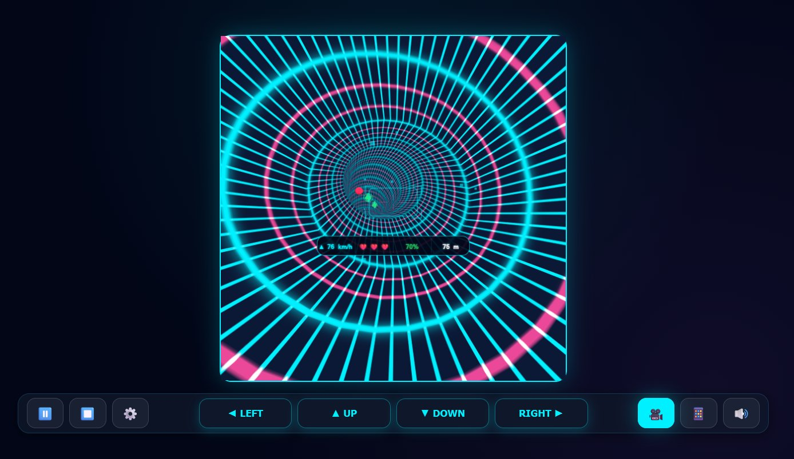
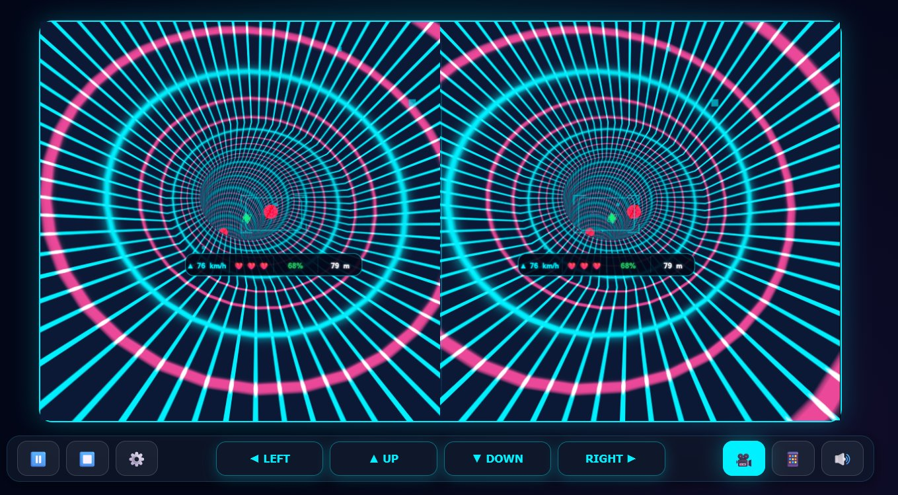
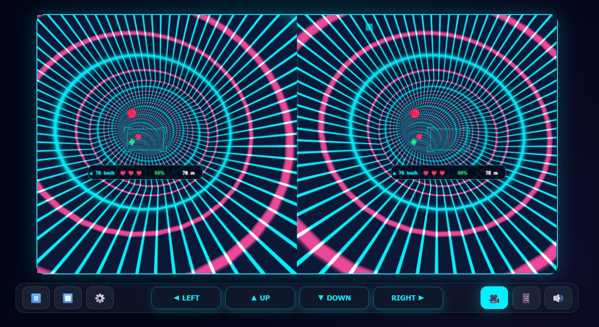
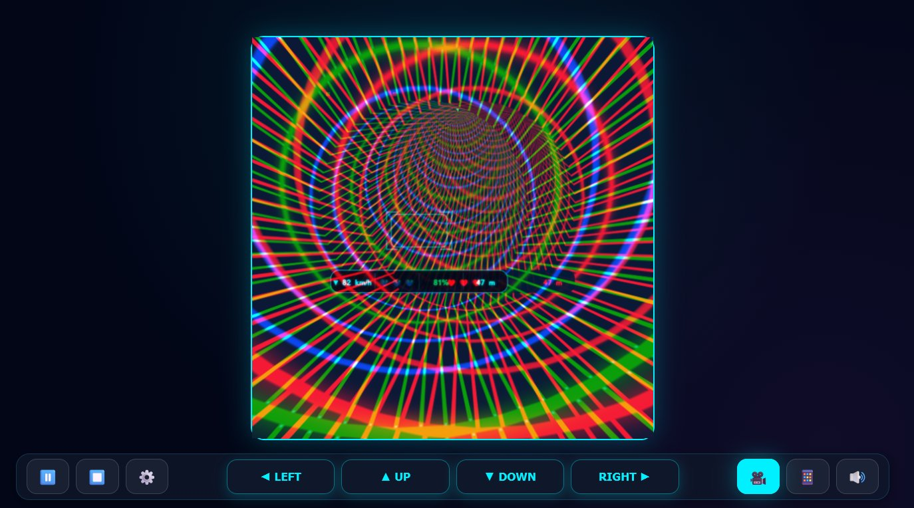

# 🚀 3D Tunnel Rush PWA (Stereoscopic 3D Game)

[](./manifest.json)
[](./sw.js)
[](./js/renderer.js)
[](./LICENSE)

🌐 **Live Playable Demo**: [srathinagiri.github.io/3DTunnelRush](https://srathinagiri.github.io/3DTunnelRush/)

An immersive, high-speed 3D stereoscopic tunnel rush Progressive Web App (PWA) built with **Three.js**, **WebGL**, and the **Web Audio API**. Relax your eyes, pop on 3D glasses or a VR headset, and maneuver your spacecraft through dynamic 3D roller-coaster tunnels, dodging spiked red space mines and collecting glowing emerald crystals!

---

## 🎬 Gameplay Demos & 3D Screenshots

| 🎥 Parallel 3D View Video | 🎥 Cross-Eye 3D View Video |
| :---: | :---: |
| [▶️ Watch Parallel 3D Demo Video](./assets/pview3dtunnel.mp4) | [▶️ Watch Cross-Eye 3D Demo Video](./assets/xview3dtunnel.mp4) |

### 📸 Screenshot Gallery

<p align="center">
  
  
  <br>
  
  
  <br>
  
</p>

---

## 🌟 Key Features

### 👓 1. Four 3D Viewing Modes & VR Headset Compatibility
- **2D View**: Standard single-camera 3D viewport.
- **Parallel 3D (Side-by-Side)**: Designed for VR headsets (Meta Quest 1/2/3/Pro, Pico, Apple Vision Pro), smart glasses (RayNeo Air, XREAL), Google Cardboard, or parallel eye relaxation.
- **Cross-Eye 3D (Side-by-Side)**: Designed for cross-eye 3D viewing—no hardware or glasses required!
- **Anaglyph 3D**: True 2-pass Red-Cyan 3D compositing—wear standard Red/Blue 3D glasses!
- **Real-time 3D Controls**: Adjust Eye Separation (IPD slider), Focal Convergence Plane, and Swap Left/Right Eyes on the fly.

### 🎥 2. Dual Camera Flight Modes
- **3rd-Person Chase View**: Flight ship moves dynamically inside the tunnel with a large 3D telemetry dashboard attached directly below the wings.
- **1st-Person Pilot Cockpit View**: Fly from inside the pilot cockpit window with a 50% semi-transparent tactical reticle crosshair and speedometer anchored deep at flight path depth ($Z = -10.0$).

### 🌌 3. Six Dynamic Sci-Fi Tunnel Themes & Hyper-Warp Transitions
- **Level 1 (0m - 999m)**: *Cyberpunk Neon* (Cyan & Pink grid)
- **Level 2 (1000m - 1999m)**: *Wooden Catacomb* (Deep amber timber planks)
- **Level 3 (2000m - 2999m)**: *Ancient Stone Ruins* (Granite slate blocks & bio-moss)
- **Level 4 (3000m - 3999m)**: *Pre-Historic Lava Cave* (Obsidian basalt & molten lava veins)
- **Level 5 (4000m - 4999m)**: *Futuristic Vault* (Metallic steel hex-grid & cyan circuit channels)
- **Level 6 (5000m+)**: *Synthwave Sunset* (Purple & Gold retrowave grid)
- **Level Warp Surge**: Reaching every 1,000 meters triggers a 3.5s 1.8x hyper-warp speed surge with glowing cyan energy shell flashes.

### 🎮 4. Flexible 4-Way Controls & Mobile/VR Optimizations
- **Keyboard**: Arrow Keys / `W`, `A`, `S`, `D` for 4-way steering.
- **Full-Screen Region & Gesture Touch**: Touch anywhere on the left 50% or right 50% of the screen to steer Left/Right; tap the upper/lower 40% region or drag your finger up/down anywhere to fly Up/Down. Supports dual-thumb arcade control!
- **Touch Virtual Keypad**: Dedicated on-screen touch buttons (`LEFT`, `UP`, `DOWN`, `RIGHT`).
- **Mobile Gyroscope**: Tilt smartphone up, down, left, or right for hands-free flight control.
- **Continuous Screen Wake Lock API**: Uses `navigator.wakeLock` to keep mobile, tablet, and VR headset screens awake during flight—preventing screen dimming or timeout during gyro & VR play.

### 🔊 5. Web Audio API Synthesizer (100% Zero-Asset Audio)
- Real-time procedural audio synthesis generated entirely in code using Web Audio API oscillators and filters:
  - **Synthwave Background Music**: Low-pass filtered pulsing bass sequence.
  - **Emerald Crystal Chime**: Ascending sci-fi arpeggio chime.
  - **Energy Boost Sweep**: Pitch-ascending laser warp sweep.
  - **Mine Collision & Game Over**: Impactful white noise explosion and bass rumble decay.

### 💾 6. Persistent Settings & State Storage
- Automatically saves and restores all user configurations (`localStorage`):
  - 3D Viewing Mode, Eye Distance (IPD), Focal Length, Swap Eyes
  - Flight View Mode (Chase / Cockpit), Sound Muted state, Gyroscope state, User Speed
  - Persistent High Score tracking.

### 📱 7. Progressive Web App (PWA) & Offline Play
- Fully installable on iOS, Android, macOS, Windows, and Meta Quest OS.
- Self-contained Service Worker (`sw.js`) caches all assets locally for 100% offline play.

---

## ⚠️ Health, Comfort & Photosensitivity Notice

> [!WARNING]
> **Photosensitivity & Visual Effects Advisory**: *3D Tunnel Rush PWA* features high-speed tunnel navigation, vibrant flashing light patterns during level warp transitions (1.8x speed surges every 1,000m), and stereoscopic 3D depth separation.
> - **Photosensitive Epilepsy**: Players prone to photosensitive seizures or visual migraines should exercise caution when playing.
> - **Motion Sickness & Eye Comfort**: If you experience eye strain, dizziness, or virtual motion discomfort, pause the flight immediately (`P` key or `⏸️` button) and lower the **IPD (Eye Distance)** slider in settings for a softer 3D depth effect.

---

## ℹ️ Technical Clarifications & Rendering Architecture

### 🥽 VR Headset Compatibility (Side-by-Side Stereoscopic Output)
- **Side-by-Side (SBS) Browser Rendering**: VR compatibility operates via **Parallel 3D Side-by-Side (SBS)** WebGL viewport rendering in browser mode (ideal for Meta Quest Browser, Apple Vision Pro Safari, Pico Browser, and mobile Cardboard viewers).
- **WebXR Distinction**: The game runs directly as a high-performance WebGL Progressive Web App inside headset browser windows; it does **not** mandate a 6-DoF WebXR room-scale VR session, allowing instant play without headset plugin downloads or native controller setup.

### 🔴🔵 Anaglyph 3D Shader & Retinal Rivalry Mitigation
- Anaglyph 3D mode uses a dedicated 2-pass matrix shader filter optimized for standard Red-Cyan 3D glasses.
- If minor ghosting or color spill occurs on highly saturated level themes, tune the live **IPD slider** in the pause menu to adjust horizontal channel separation for your specific glasses and screen color temperature.

### 📐 Dynamic Auto-Responsive Viewport Architecture
- The WebGL rendering engine (`js/renderer.js`) features **100% dynamic viewport auto-scaling** based on real-time element bounds and `window.devicePixelRatio`.
- Viewports dynamically adapt to mobile portrait, ultra-compact mobile landscape (reclaiming 90%+ vertical screen space), high-refresh desktop monitors, and VR browser windows up to 4K+ resolutions without static pixel locks.

---

## 🎮 Controls Summary

| Control Action | Keyboard | Touch / Mobile / VR |
| :--- | :--- | :--- |
| **Steer Left** | `Left Arrow` / `A` | Touch Left Half Screen / `◄ LEFT` / Swipe Left |
| **Steer Right** | `Right Arrow` / `D` | Touch Right Half Screen / `RIGHT ►` / Swipe Right |
| **Fly Up** | `Up Arrow` / `W` | Touch Top 40% Screen / `▲ UP` / Drag Up |
| **Fly Down** | `Down Arrow` / `S` | Touch Bottom 40% Screen / `▼ DOWN` / Drag Down |
| **Pause Game** | `P` / `Space` | `⏸️` Icon Button |
| **Toggle View** | `V` | `🎥` Icon Button |
| **Toggle Gyro** | - | `📱` Icon Button |
| **Toggle Audio** | `M` | `🔊` Icon Button |

---

## 🛠️ Installation & Local Setup

Since **3D Tunnel Rush PWA** is built with native ES6 Modules and Three.js, you can run it directly using any static web server:

### Option A: Using Python (Built-in HTTP Server)
```bash
python -m http.server 8085
```
Open your browser at `http://localhost:8085`.

### Option B: Using Node.js `npx http-server`
```bash
npx http-server -p 8085
```
Open your browser at `http://localhost:8085`.

---

## 🏗️ Project Architecture

```
3DTunnelRush/
├── index.html            # Main HTML5 App Entry & Controls Drawer
├── manifest.json         # PWA Manifest Configuration
├── sw.js                 # PWA Service Worker (Offline Cache)
├── css/
│   └── styles.css        # Responsive Design System & Layout
├── js/
│   ├── app.js            # Main Game Loop & Lifecycle Manager
│   ├── renderer.js       # Stereoscopic 3D Render Engine (2D, Parallel, Cross, Anaglyph)
│   ├── tunnel.js         # Procedural Curved 3D Tunnel & Obstacle Generator
│   ├── player.js         # Player Spacecraft Physics & Visual Auras
│   ├── hud3d.js          # 3D Scene HUD & Reticle Renderer
│   ├── controls.js       # Input Handler (Keyboard, Touch, Gyroscope)
│   ├── audio.js          # Web Audio Synthesizer
│   ├── ui.js             # UI Manager & Persistent Settings
│   └── lib/
│       └── three.min.js  # Local Self-Contained Three.js Dependency
└── assets/
    └── favicon.svg       # App Vector Favicon & Icon
```

---

## 📜 License

Distributed under the **MIT License**. See `LICENSE` for details.
